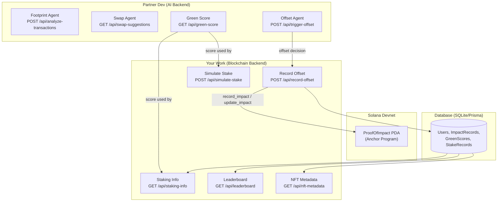
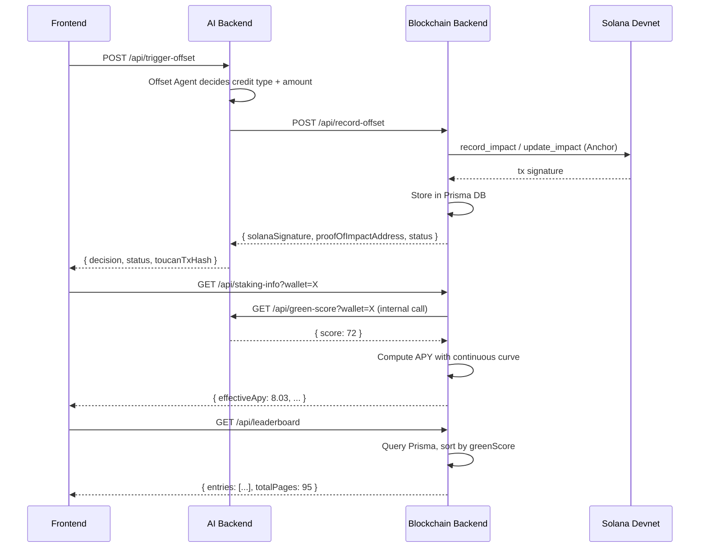

# CarbonIQ — Solana Blockchain Backend Implementation Plan

> **Target network:** Solana **devnet**
> **Monorepo root:** `/Users/aayanmapara/Hackathons/innovation-hacks`
> **Shared contracts:** `@carboniq/contracts` in `contracts/`

---

## Architecture Overview



---

## What Already Exists

| Component | Status | Notes |
|-----------|--------|-------|
| `anchor/programs/carbon_iq/src/lib.rs` | ✅ Scaffolded | `record_impact` + `update_impact` instructions, `ProofOfImpact` PDA, events, errors |
| `anchor/tests/carbon_iq.ts` | ✅ Basic tests | Record + update impact |
| `contracts/` | ✅ Complete | Zod schemas, types, enums, constants, route map for **all** endpoints |
| `api/src/routes/analyzeTransactions.ts` | ⚠️ Mock | Returns random data, no Solana integration |
| `api/src/routes/greenScore.ts` | ⚠️ Mock | Deterministic mock from wallet chars |
| `api/src/routes/simulateStake.ts` | ⚠️ Partial | Linear green bonus, no DB, no `GET /staking-info` |
| `api/prisma/schema.prisma` | ⚠️ Basic | User, TransactionAnalysis, ImpactRecord — missing offset metadata, staking, leaderboard |
| Record Offset endpoint | ❌ Missing | Not yet created |
| Staking Info endpoint | ❌ Missing | Not yet created |
| Leaderboard endpoint | ❌ Missing | Not yet created |
| NFT Metadata endpoint | ❌ Missing | Not yet created |
| Solana service layer | ❌ Missing | No `@solana/web3.js` integration in the API |
| Anchor devnet deploy | ❌ Not done | Anchor.toml points to Localnet, program ID is placeholder |

---

## Phase 0 — Solana Dev Setup (Hours 0–1)

### Goal
Get Solana CLI, Anchor, and devnet fully configured. Generate test wallets. Verify `@solana/web3.js` is usable in the API.

### Tasks

#### 0.1 Environment Prerequisites
```bash
# Verify Solana CLI is installed
solana --version   # Needs >= 1.18.x

# Verify Anchor CLI
anchor --version   # Needs >= 0.30.x

# Set devnet
solana config set --url https://api.devnet.solana.com
```

#### 0.2 Wallet Keypairs
```bash
# Generate a deployer wallet (if ~/.config/solana/id.json doesn't exist)
solana-keygen new --outfile ~/.config/solana/id.json --no-bip39-passphrase

# Generate a test user wallet for integration tests
solana-keygen new --outfile anchor/tests/test-user.json --no-bip39-passphrase

# Airdrop devnet SOL to both
solana airdrop 2 ~/.config/solana/id.json --url devnet
solana airdrop 2 anchor/tests/test-user.json --url devnet
```

#### 0.3 Update Anchor.toml for Devnet

##### [MODIFY] [Anchor.toml](file:///Users/aayanmapara/Hackathons/innovation-hacks/anchor/Anchor.toml)

Change cluster from `Localnet` to `Devnet` and add a `[programs.devnet]` section:

```toml
[features]
seeds = false
skip-lint = false

[programs.devnet]
carbon_iq = "<REAL_PROGRAM_ID_AFTER_FIRST_BUILD>"

[registry]
url = "https://api.apr.dev"

[provider]
cluster = "Devnet"
wallet = "~/.config/solana/id.json"

[scripts]
test = "yarn run ts-mocha -p ./tsconfig.json -t 1000000 tests/**/*.ts"
```

#### 0.4 First Anchor Build + Get Program ID
```bash
cd anchor
anchor build
# Get the program ID from the built keypair
solana address -k target/deploy/carbon_iq-keypair.json
# Update lib.rs declare_id!() and Anchor.toml with this real ID
```

#### 0.5 Verify `@solana/web3.js` in API
Already in `api/package.json` (`"@solana/web3.js": "^1.98.0"`). Run `npm install` in `api/` to ensure deps are up to date.

#### 0.6 Environment Variables

##### [MODIFY] [.env.example](file:///Users/aayanmapara/Hackathons/innovation-hacks/api/.env.example)

```env
# CarbonIQ API Environment
PORT=4000
FRONTEND_URL=http://localhost:3000
DATABASE_URL="file:./dev.db"
SOLANA_RPC_URL=https://api.devnet.solana.com
SOLANA_PROGRAM_ID=<REAL_PROGRAM_ID>
# Base58-encoded private key of the API's payer wallet (for server-side tx signing)
SOLANA_PAYER_SECRET_KEY=<BASE58_SECRET_KEY>
```

> [!IMPORTANT]
> `SOLANA_PAYER_SECRET_KEY` is the API server's wallet that pays for proof-of-impact transactions. This should be a devnet wallet funded via airdrop. **Never use a mainnet key.**

---

## Phase 1 — Proof-of-Impact Program Enhancement + Deploy (Hours 1–3)

### Goal
Enhance the Anchor program to store `credit_type`, deploy to devnet, and generate the IDL + TypeScript types for API consumption.

### 1.1 Enhance the Anchor Program

##### [MODIFY] [lib.rs](file:///Users/aayanmapara/Hackathons/innovation-hacks/anchor/programs/carbon_iq/src/lib.rs)

**Changes needed:**
1. Replace placeholder `declare_id!()` with real program ID
2. Add `credit_type` field (stored as `u8` enum) to `ProofOfImpact`
3. Add `credit_type` parameter to `record_impact` instruction
4. Expand the `ImpactRecorded` event to include `credit_type`
5. Add a `get_impact` view-like instruction (optional, can read via RPC)

**Updated account struct:**
```rust
#[account]
#[derive(InitSpace)]
pub struct ProofOfImpact {
    pub user_wallet: Pubkey,      // 32 bytes
    pub co2_offset_amount: u64,   // 8 bytes  — grams of CO₂
    pub timestamp: i64,           // 8 bytes  — last updated
    pub credit_type: u8,          // 1 byte   — CarbonCreditType enum index
    pub bump: u8,                 // 1 byte
}
// Total: 8 (discriminator) + 32 + 8 + 8 + 1 + 1 = 58 bytes
```

**Credit type enum mapping (must match `contracts/src/enums.ts`):**
```
0 = renewable_energy
1 = forestry
2 = methane_capture
3 = direct_air_capture
4 = soil_carbon
5 = ocean_based
```

**Updated `record_impact` signature:**
```rust
pub fn record_impact(
    ctx: Context<RecordImpact>,
    co2_offset_amount: u64,
    credit_type: u8,
) -> Result<()>
```

**Updated `update_impact` signature:**
```rust
pub fn update_impact(
    ctx: Context<UpdateImpact>,
    additional_offset: u64,
    credit_type: u8,  // updates the credit type to the latest
) -> Result<()>
```

**Validation:**
```rust
require!(credit_type <= 5, ErrorCode::InvalidCreditType);
```

**New error variant:**
```rust
#[error_code]
pub enum ErrorCode {
    #[msg("Arithmetic overflow when accumulating offset.")]
    Overflow,
    #[msg("Invalid carbon credit type. Must be 0–5.")]
    InvalidCreditType,
}
```

### 1.2 Update Anchor Tests

##### [MODIFY] [carbon_iq.ts](file:///Users/aayanmapara/Hackathons/innovation-hacks/anchor/tests/carbon_iq.ts)

- Pass `credit_type` param to `recordImpact` and `updateImpact`
- Assert `creditType` field on fetched accounts
- Add test for invalid credit type (expect failure)

### 1.3 Build + Deploy to Devnet
```bash
cd anchor
anchor build
anchor deploy --provider.cluster devnet
# Note the deployed program ID — update lib.rs and Anchor.toml if needed
anchor build  # Rebuild with correct ID
anchor deploy --provider.cluster devnet  # Redeploy
```

### 1.4 Copy IDL to API
```bash
# After anchor build, the IDL is at:
# anchor/target/idl/carbon_iq.json
# anchor/target/types/carbon_iq.ts
# Copy these to the API for use
mkdir -p api/src/solana
cp anchor/target/idl/carbon_iq.json api/src/solana/
cp anchor/target/types/carbon_iq.ts api/src/solana/
```

### 1.5 Run Tests on Devnet
```bash
cd anchor
anchor test --provider.cluster devnet --skip-local-validator
```

---

## Phase 2 — Staking Simulation (Hours 3–5)

### Goal
Build the full staking logic with a **continuous** yield multiplier curve (not tiers). Create two endpoints: `GET /api/staking-info` and enhance `POST /api/simulate-stake`.

### 2.1 Staking Math — Continuous Curve

The yield boost formula uses a **sigmoid-ish curve** so higher green scores get disproportionately rewarded:

```
greenBonus = STAKING_GREEN_BONUS_MAX × (greenScore / 100)^1.5
effectiveApy = STAKING_BASE_APY + greenBonus
estimatedYield = principal × (effectiveApy / 100) × (durationDays / 365)
```

| Green Score | Green Bonus | Effective APY |
|:-----------:|:-----------:|:-------------:|
| 0           | 0.00%       | 6.50%         |
| 25          | 0.31%       | 6.81%         |
| 50          | 0.88%       | 7.38%         |
| 75          | 1.62%       | 8.12%         |
| 100         | 2.50%       | 9.00%         |

Constants from `@carboniq/contracts`:
- `STAKING_BASE_APY = 6.5`
- `STAKING_GREEN_BONUS_MAX = 2.5`

### 2.2 Create Staking Service

##### [NEW] [stakingService.ts](file:///Users/aayanmapara/Hackathons/innovation-hacks/api/src/services/stakingService.ts)

```typescript
import {
  STAKING_BASE_APY,
  STAKING_GREEN_BONUS_MAX,
} from "@carboniq/contracts";

export function computeGreenBonus(greenScore: number): number {
  // Continuous curve: bonus = maxBonus × (score/100)^1.5
  return STAKING_GREEN_BONUS_MAX * Math.pow(greenScore / 100, 1.5);
}

export function computeEffectiveApy(greenScore: number): number {
  return STAKING_BASE_APY + computeGreenBonus(greenScore);
}

export function simulateStake(
  principal: number,
  durationDays: number,
  greenScore: number
) {
  const greenBonus = computeGreenBonus(greenScore);
  const effectiveApy = STAKING_BASE_APY + greenBonus;
  const estimatedYield = principal * (effectiveApy / 100) * (durationDays / 365);
  
  return {
    principal,
    durationDays,
    baseApy: STAKING_BASE_APY,
    greenBonus: parseFloat(greenBonus.toFixed(4)),
    effectiveApy: parseFloat(effectiveApy.toFixed(4)),
    estimatedYield: parseFloat(estimatedYield.toFixed(6)),
    totalReturn: parseFloat((principal + estimatedYield).toFixed(6)),
  };
}
```

### 2.3 Update `POST /api/simulate-stake`

##### [MODIFY] [simulateStake.ts](file:///Users/aayanmapara/Hackathons/innovation-hacks/api/src/routes/simulateStake.ts)

- Import `SimulateStakeRequestSchema` from `@carboniq/contracts` (replace inline schema)
- Use `stakingService.simulateStake()` instead of inline math
- Validate response matches `SimulateStakeResponseSchema`

### 2.4 Create `GET /api/staking-info`

##### [NEW] [stakingInfo.ts](file:///Users/aayanmapara/Hackathons/innovation-hacks/api/src/routes/stakingInfo.ts)

**Request:** `GET /api/staking-info?wallet=<address>`

**Logic:**
1. Validate wallet with `StakingInfoRequestSchema`
2. Look up user from Prisma DB → get `greenScore`
3. If user doesn't exist, create with `greenScore = 0`
4. Compute `baseApy`, `greenBonus`, `effectiveApy` via `stakingService`
5. Look up any staked amount + accrued yield from `StakeRecord` table (mock: 0 initially)

**Response shape** (from `StakingInfoResponseSchema`):
```json
{
  "wallet": "AbCd...xYz1",
  "greenScore": 72,
  "baseApy": 6.5,
  "greenBonus": 1.53,
  "effectiveApy": 8.03,
  "stakedAmount": 0,
  "accruedYield": 0
}
```

### 2.5 Register New Route

##### [MODIFY] [index.ts](file:///Users/aayanmapara/Hackathons/innovation-hacks/api/src/index.ts)

Add:
```typescript
import { stakingInfoRouter } from "./routes/stakingInfo.js";
app.use("/api/staking-info", stakingInfoRouter);
```

### 2.6 Update Prisma Schema (optional StakeRecord)

##### [MODIFY] [schema.prisma](file:///Users/aayanmapara/Hackathons/innovation-hacks/api/prisma/schema.prisma)

Add a `StakeRecord` model for simulation history:
```prisma
model StakeRecord {
  id            String   @id @default(cuid())
  userId        String
  amount        Float
  durationDays  Int
  greenScore    Int
  effectiveApy  Float
  estimatedYield Float
  simulatedAt   DateTime @default(now())

  user User @relation(fields: [userId], references: [id])
}
```

And add the relation to User:
```prisma
model User {
  ...existing fields...
  stakes       StakeRecord[]
}
```

---

## Phase 3 — Offset Recording Flow (Hours 5–7)

### Goal
When the AI Backend's Offset Agent triggers an offset, this endpoint writes proof-of-impact to Solana devnet, creates a mock Toucan credit retirement tx, and stores the record in the database.

### 3.1 Create Solana Service

##### [NEW] [solanaService.ts](file:///Users/aayanmapara/Hackathons/innovation-hacks/api/src/services/solanaService.ts)

Core service that wraps `@solana/web3.js` + `@coral-xyz/anchor`:

```typescript
import { Connection, Keypair, PublicKey } from "@solana/web3.js";
import { AnchorProvider, Program, Wallet } from "@coral-xyz/anchor";
import idl from "../solana/carbon_iq.json";
import { CarbonIq } from "../solana/carbon_iq";

// --- Initialization ---
// - Read SOLANA_RPC_URL, SOLANA_PROGRAM_ID, SOLANA_PAYER_SECRET_KEY from env
// - Create Connection, Keypair, AnchorProvider, Program instance

// --- Public API ---

/**
 * recordImpact — calls the Anchor program's record_impact instruction.
 * Creates a new ProofOfImpact PDA for the user.
 * Returns: { signature, proofOfImpactAddress }
 */
export async function recordImpact(
  userWallet: string,
  co2OffsetGrams: number,
  creditType: number
): Promise<{ signature: string; proofOfImpactAddress: string }>

/**
 * updateImpact — calls the Anchor program's update_impact instruction.
 * Accumulates additional offset to existing PDA.
 * Returns: { signature, cumulativeCo2eGrams }
 */
export async function updateImpact(
  userWallet: string,
  additionalOffsetGrams: number,
  creditType: number
): Promise<{ signature: string; cumulativeCo2eGrams: number }>

/**
 * getProofOfImpact — reads the ProofOfImpact PDA for a wallet.
 * Returns null if no PDA exists.
 */
export async function getProofOfImpact(
  userWallet: string
): Promise<{ co2OffsetAmount: number; creditType: number; timestamp: number } | null>

/**
 * getProofOfImpactPda — derives the PDA address.
 */
export function getProofOfImpactPda(userWallet: string): PublicKey
```

**Key implementation detail:** The API server acts as the payer (not the user's wallet), because users interact through the web frontend and don't sign on-chain transactions directly. The PDA is derived from `[b"proof", user_wallet_pubkey]`.

> [!WARNING]
> The Anchor program currently requires `user` to be a `Signer`. For the API server to submit transactions on behalf of users, we need to either:
> - **Option A:** Change the program so `user` is just a `Pubkey` argument (not a signer), and add an `authority` signer that is the API server. This is the recommended approach for a server-side model.
> - **Option B:** Keep user as signer and have the frontend submit transactions directly via wallet adapter. This means the API just coordinates but doesn't submit on-chain tx.
>
> **Recommended: Option A** — Add an `authority` field to the program, keep `user` as a non-signer `AccountInfo`, and have the authority be the API payer.

### 3.2 Mock Toucan Integration

##### [NEW] [toucanService.ts](file:///Users/aayanmapara/Hackathons/innovation-hacks/api/src/services/toucanService.ts)

```typescript
/**
 * Simulates a Toucan Protocol credit retirement transaction.
 * In production, this would call the Toucan SDK to retire carbon credits
 * on Polygon and return a real tx hash.
 */
export async function mockRetireCarbonCredits(
  creditType: string,
  co2eGrams: number,
  projectName: string
): Promise<{
  toucanTxHash: string;
  retiredAt: string;
}> {
  // Simulate network delay
  await new Promise(r => setTimeout(r, 200));
  
  // Generate a mock Polygon tx hash
  const hash = "0x" + Array.from({ length: 64 }, () => 
    Math.floor(Math.random() * 16).toString(16)
  ).join("");
  
  return {
    toucanTxHash: hash,
    retiredAt: new Date().toISOString(),
  };
}
```

### 3.3 Create `POST /api/record-offset` Endpoint

##### [NEW] [recordOffset.ts](file:///Users/aayanmapara/Hackathons/innovation-hacks/api/src/routes/recordOffset.ts)

**Request** (validated by `RecordOffsetRequestSchema`):
```json
{
  "wallet": "AbCd...xYz1",
  "co2eGrams": 15000,
  "creditType": "forestry",
  "toucanTxHash": "0xabc123..."  // optional, from trigger-offset
}
```

**Logic flow:**
1. Validate request body with `RecordOffsetRequestSchema`
2. Map `creditType` string → `u8` enum index (0–5)
3. Call `toucanService.mockRetireCarbonCredits()` if no `toucanTxHash` provided
4. Check if user has an existing `ProofOfImpact` PDA on-chain:
   - If **no** → call `solanaService.recordImpact(wallet, co2eGrams, creditTypeIndex)`
   - If **yes** → call `solanaService.updateImpact(wallet, co2eGrams, creditTypeIndex)`
5. Store in Prisma `ImpactRecord` table (with `onChainTxHash`, `creditType`, `toucanTxHash`)
6. Update user's `greenScore` (increment based on offset activity)

**Response** (validated by `RecordOffsetResponseSchema`):
```json
{
  "wallet": "AbCd...xYz1",
  "solanaSignature": "5xYz...",
  "proofOfImpactAddress": "7AbC...",
  "cumulativeCo2eGrams": 17000,
  "status": "recorded_on_chain"
}
```

### 3.4 Update Prisma Schema for Offset Metadata

##### [MODIFY] [schema.prisma](file:///Users/aayanmapara/Hackathons/innovation-hacks/api/prisma/schema.prisma)

Enhance `ImpactRecord`:
```prisma
model ImpactRecord {
  id              String   @id @default(cuid())
  userId          String
  co2OffsetGrams  Int
  creditType      String   // "forestry", "renewable_energy", etc.
  toucanTxHash    String?  // Mock Polygon tx hash
  onChainTxHash   String?  // Solana signature
  proofPda        String?  // On-chain PDA address
  status          String   @default("pending") // "pending" | "recorded_on_chain" | "failed"
  recordedAt      DateTime @default(now())

  user User @relation(fields: [userId], references: [id])
}
```

### 3.5 Register the Route

##### [MODIFY] [index.ts](file:///Users/aayanmapara/Hackathons/innovation-hacks/api/src/index.ts)

```typescript
import { recordOffsetRouter } from "./routes/recordOffset.js";
app.use("/api/record-offset", recordOffsetRouter);
```

---

## Phase 4 — NFT Metadata + Leaderboard (Hours 7–9)

### Goal
Build mock Impact NFT metadata (Metaplex-compatible JSON) and a leaderboard API from stored Green Scores.

### 4.1 NFT Metadata Endpoint

##### [NEW] [nftMetadata.ts](file:///Users/aayanmapara/Hackathons/innovation-hacks/api/src/routes/nftMetadata.ts)

**Request:** `GET /api/nft-metadata?wallet=<address>`

**Logic:**
1. Look up user from DB → get `greenScore`, total `co2OffsetGrams`, tier
2. Determine NFT rarity from green score:
   ```
   0–24:   common
   25–49:  uncommon
   50–74:  rare
   75–89:  epic
   90–100: legendary
   ```
3. Build Metaplex-compatible JSON matching `ImpactNftMetadataSchema`

**Response** (matches `ImpactNftMetadataSchema`):
```json
{
  "name": "CarbonIQ Impact #42",
  "symbol": "CIQNFT",
  "description": "Proof of environmental impact: 15,000g CO₂ offset. Green Score: 72 (Tree tier).",
  "image": "https://arweave.net/placeholder-nft-image",  
  "external_url": "https://carboniq.app/impact/AbCd...xYz1",
  "attributes": [
    { "trait_type": "Green Score", "value": 72 },
    { "trait_type": "Tier", "value": "tree" },
    { "trait_type": "Total CO₂ Offset (g)", "value": 15000 },
    { "trait_type": "Credit Type", "value": "forestry" },
    { "trait_type": "Rarity", "value": "rare" },
    { "trait_type": "Offset Count", "value": 3 }
  ],
  "properties": {
    "category": "image",
    "files": [
      { "uri": "https://arweave.net/placeholder-nft-image", "type": "image/png" }
    ],
    "creators": [
      { "address": "AbCd...xYz1", "share": 100 }
    ]
  }
}
```

> [!NOTE]
> We're using placeholder image URIs. In production, NFT images would be generated dynamically (e.g., a tree that grows based on green score) and uploaded to Arweave/IPFS.

### 4.2 Leaderboard Endpoint

##### [NEW] [leaderboard.ts](file:///Users/aayanmapara/Hackathons/innovation-hacks/api/src/routes/leaderboard.ts)

**Request:** `GET /api/leaderboard?page=1&pageSize=20`

**Logic:**
1. Validate with `LeaderboardRequestSchema`
2. Query Prisma `User` table ordered by `greenScore DESC`
3. Paginate with `skip` + `take`
4. For each user, compute tier from score using `GREEN_SCORE_TIER_THRESHOLDS`
5. Truncate wallet for display: `wallet.slice(0,4) + "…" + wallet.slice(-4)`
6. Include total CO₂ offset from `ImpactRecord` (sum `co2OffsetGrams`)

**Response** (matches `LeaderboardResponseSchema`):
```json
{
  "entries": [
    {
      "rank": 1,
      "wallet": "AbCd...xYz1AbCd...xYz1AbCd...xYz1AbCd...xYz1",
      "walletShort": "AbCd…xYz1",
      "score": 92,
      "tier": "earth_guardian",
      "totalCo2eOffset": 50000
    }
  ],
  "totalEntries": 1893,
  "page": 1,
  "pageSize": 20,
  "totalPages": 95
}
```

### 4.3 Seed Leaderboard Data

##### [NEW] [seed.ts](file:///Users/aayanmapara/Hackathons/innovation-hacks/api/prisma/seed.ts)

Create a seed script that:
1. Generates ~50 mock users with random wallet addresses
2. Assigns random green scores (weighted toward 30–70 range)
3. Creates 1–5 `ImpactRecord`s per user with random CO₂ offsets
4. This ensures the leaderboard has data for demo

### 4.4 Register the Routes

##### [MODIFY] [index.ts](file:///Users/aayanmapara/Hackathons/innovation-hacks/api/src/index.ts)

```typescript
import { nftMetadataRouter } from "./routes/nftMetadata.js";
import { leaderboardRouter } from "./routes/leaderboard.js";
app.use("/api/nft-metadata", nftMetadataRouter);
app.use("/api/leaderboard", leaderboardRouter);
```

---

## Phase 5 — Testing + Demo Prep (Hours 9–12)

### Goal
End-to-end testing of all on-chain flows, ensure devnet transactions work reliably, prep for demo.

### 5.1 Anchor Program Tests (Devnet)

##### [MODIFY] [carbon_iq.ts](file:///Users/aayanmapara/Hackathons/innovation-hacks/anchor/tests/carbon_iq.ts)

Expand tests to cover:
- ✅ `record_impact` with `credit_type` param
- ✅ `update_impact` accumulates correctly
- ✅ Invalid `credit_type` (> 5) fails
- ✅ PDA derivation is deterministic
- ✅ Event emission contains all fields

### 5.2 API Integration Tests

##### [NEW] [api.test.ts](file:///Users/aayanmapara/Hackathons/innovation-hacks/api/tests/api.test.ts)

Test each endpoint:

| Endpoint | Test Cases |
|----------|-----------|
| `POST /api/record-offset` | Valid offset record → returns Solana signature; duplicate wallet → updates existing PDA; invalid credit type → 400 |
| `GET /api/staking-info` | Returns correct APY calculation; new wallet creates user; existing wallet returns staked amount |
| `POST /api/simulate-stake` | Various green scores produce correct yield curve; edge cases: score 0, score 100 |
| `GET /api/leaderboard` | Pagination works correctly; entries sorted by score DESC; correct tier assignment |
| `GET /api/nft-metadata` | Returns Metaplex-compatible JSON; attributes match user data; unknown wallet returns 404 |

### 5.3 End-to-End Flow Test

Manual/scripted E2E flow:
```
1. POST /api/record-offset  { wallet, co2eGrams: 5000, creditType: "forestry" }
   → Verify Solana tx on explorer: https://explorer.solana.com/tx/<sig>?cluster=devnet
   
2. GET /api/staking-info?wallet=<same wallet>
   → Verify greenScore reflects the offset
   
3. POST /api/simulate-stake { amount: 100, durationDays: 30, greenScore: <from step 2> }
   → Verify yield is correct

4. GET /api/leaderboard?page=1
   → Verify the wallet appears in the leaderboard

5. GET /api/nft-metadata?wallet=<same wallet>
   → Verify metadata reflects the 5000g offset
```

### 5.4 Devnet Transaction Reliability

- Add retry logic in `solanaService.ts` for transient RPC failures (3 retries with exponential backoff)
- Add `confirmTransaction` with `confirmed` commitment level
- Log all transaction signatures for debugging

---

## File Map — All Files to Create or Modify

### New Files

| Path | Purpose |
|------|---------|
| `api/src/services/solanaService.ts` | Anchor program client wrapper |
| `api/src/services/toucanService.ts` | Mock Toucan credit retirement |
| `api/src/services/stakingService.ts` | Staking math (continuous curve) |
| `api/src/routes/recordOffset.ts` | `POST /api/record-offset` |
| `api/src/routes/stakingInfo.ts` | `GET /api/staking-info` |
| `api/src/routes/leaderboard.ts` | `GET /api/leaderboard` |
| `api/src/routes/nftMetadata.ts` | `GET /api/nft-metadata` |
| `api/src/solana/carbon_iq.json` | Anchor IDL (copied from build) |
| `api/src/solana/carbon_iq.ts` | Anchor TypeScript types (copied from build) |
| `api/prisma/seed.ts` | Leaderboard seed data |
| `api/tests/api.test.ts` | API integration tests |

### Modified Files

| Path | Change |
|------|--------|
| `anchor/programs/carbon_iq/src/lib.rs` | Add `credit_type` field + validation |
| `anchor/Anchor.toml` | Switch to devnet, real program ID |
| `anchor/tests/carbon_iq.ts` | Update for new `credit_type` param |
| `api/src/index.ts` | Register 3 new routes |
| `api/src/routes/simulateStake.ts` | Use `@carboniq/contracts` schemas + service |
| `api/prisma/schema.prisma` | Add `StakeRecord`, enhance `ImpactRecord`, add `creditType`/`toucanTxHash` |
| `api/.env.example` | Add `SOLANA_PROGRAM_ID`, `SOLANA_PAYER_SECRET_KEY` |

---

## API Contract Summary for Partner Dev

> [!IMPORTANT]
> **This section is critical for your partner dev.** These are the endpoints YOU own (blockchain backend). Your partner's AI agents should call these after their processing is done.

### Endpoints You Own

| Method | Path | Owner | Request | Response |
|--------|------|-------|---------|----------|
| `POST` | `/api/record-offset` | blockchain | `RecordOffsetRequestSchema` | `RecordOffsetResponseSchema` |
| `GET` | `/api/staking-info` | blockchain | `StakingInfoRequestSchema` (query) | `StakingInfoResponseSchema` |
| `POST` | `/api/simulate-stake` | blockchain | `SimulateStakeRequestSchema` | `SimulateStakeResponseSchema` |
| `GET` | `/api/leaderboard` | blockchain | `LeaderboardRequestSchema` (query) | `LeaderboardResponseSchema` |
| `GET` | `/api/nft-metadata` | blockchain | `wallet` query param | `ImpactNftMetadataSchema` |

### Endpoints Your Partner Owns (that you depend on)

| Method | Path | Owner | What You Need From It |
|--------|------|-------|----------------------|
| `GET` | `/api/green-score` | AI | Used by `GET /api/staking-info` to fetch user's green score |
| `POST` | `/api/trigger-offset` | AI | Triggers offset → then calls your `POST /api/record-offset` |

### Integration Flow



---

## Environment Variables Summary

| Variable | Required | Example | Purpose |
|----------|----------|---------|---------|
| `PORT` | yes | `4000` | API server port |
| `FRONTEND_URL` | yes | `http://localhost:3000` | CORS allowed origin |
| `DATABASE_URL` | yes | `file:./dev.db` | SQLite database path |
| `SOLANA_RPC_URL` | yes | `https://api.devnet.solana.com` | Solana RPC endpoint |
| `SOLANA_PROGRAM_ID` | yes | `<from anchor deploy>` | Deployed Anchor program ID |
| `SOLANA_PAYER_SECRET_KEY` | yes | `<base58 key>` | Server wallet for paying tx fees |

---

## Verification Plan

### Automated Tests
```bash
# 1. Anchor program tests on devnet
cd anchor && anchor test --provider.cluster devnet --skip-local-validator

# 2. Prisma migration
cd api && npx prisma db push

# 3. Seed leaderboard data
cd api && npx tsx prisma/seed.ts

# 4. Start API server
cd api && npm run dev

# 5. Run API integration tests
cd api && npx tsx tests/api.test.ts
```

### Manual Verification
1. Verify deployed program on [Solana Explorer (devnet)](https://explorer.solana.com/?cluster=devnet)
2. After `POST /api/record-offset`, verify the transaction signature on explorer
3. Check PDA account data matches expected CO₂ offset + credit type
4. Verify leaderboard pagination with curl
5. Verify NFT metadata JSON passes [Metaplex metadata validator](https://docs.metaplex.com)

---

## Open Questions

> [!IMPORTANT]
> **Program authority model:** Should the API server sign on-chain transactions on behalf of users (requires modifying the Anchor program to separate `authority` from `user`), or should the frontend submit transactions directly via wallet adapter? **Recommendation: API server approach** for hackathon simplicity, but this is a security tradeoff.

> [!WARNING]
> **Green Score source:** The `GET /api/staking-info` endpoint needs the user's Green Score. Should it:
> 1. Store a cached copy in Prisma (`User.greenScore`) updated periodically, or
> 2. Call the partner's `GET /api/green-score` endpoint in real-time?
> **Recommendation: Option 1** (cached in DB) for reliability. Partner's API can call a webhook or `PUT /api/update-green-score` to push updates.

> [!NOTE]
> **NFT image generation:** Should we generate placeholder NFT images using an image generation tool, or use static placeholder URIs for the hackathon demo?
